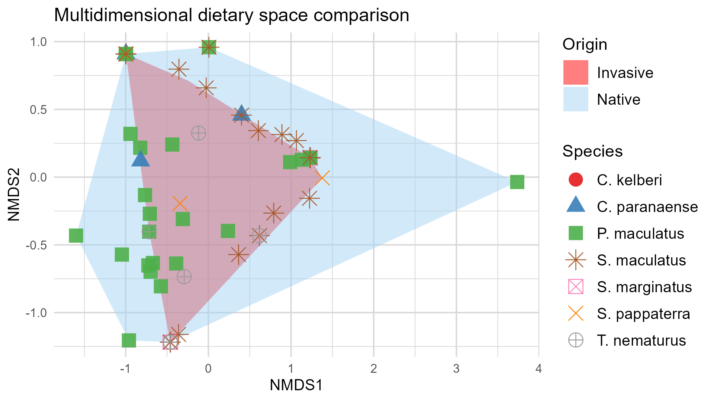

# carnivorous-fish-diet-analysis

Statistical analysis comparing the diet of **native and invasive carnivorous fish** using stomach content data, ecological indices, and multivariate analyses in R.

## Project Overview

This project compares the diet of **native and invasive carnivorous fish** through stomach content analysis. The workflow combines ecological metrics and multivariate analyses to identify the importance of different food items, evaluate trophic niche breadth, quantify dietary overlap, and assess differences in diet composition between the two groups.

The project demonstrates skills in data cleaning, ecological statistics, multivariate analysis, and reproducible workflows applied to environmental data science.

<p align="center">
  
</p>

## Objectives

- Compare the diet composition of native and invasive fish.
- Calculate ecological diet indices.
- Evaluate trophic niche breadth.
- Measure dietary overlap between groups.
- Visualize dietary differences using multivariate methods.

## Dataset

The dataset contains stomach content information for carnivorous and piscivorous fish, including:

- Species identification
- Native or invasive origin
- Food items found in stomach contents
- Relative percentage of each food item
- Morphometric measurements

## Methods

The analyses include:

| Method | Purpose |
|---------|---------|
| Food Importance Index (IAi) | Quantify the importance of each food item |
| Levins Index | Measure trophic niche breadth |
| Standardized Levins | Compare niche breadth between groups |
| Pianka Index | Estimate dietary overlap |
| Bray–Curtis Dissimilarity | Measure differences in diet composition |
| NMDS | Visualize dietary similarity |

## Workflow

Raw Data → Data Cleaning → IAi Calculation → Levins Index → Pianka Index → Bray–Curtis Dissimilarity → NMDS Visualization

## Results

The analyses provided complementary perspectives on dietary ecology:

- **IAi:** Identified the most important food resources for each species and for native versus invasive groups.
- **Levins Index:** Estimated trophic niche breadth for each group.
- **Pianka Index:** Quantified dietary overlap between native and invasive fish.
- **NMDS:** Visualized dietary similarity using Bray–Curtis dissimilarity.

```

## Skills Demonstrated

- Data Cleaning
- Exploratory Data Analysis
- Ecological Statistics
- Multivariate Analysis
- R Programming
- Reproducible Research Workflow

## Technologies

- R
- vegan
- ggplot2
- dplyr
- Ecological Statistics

## Key Takeaways

This project applies ecological statistics and reproducible data analysis techniques to compare dietary patterns between native and invasive fish species. It demonstrates practical skills in data preprocessing, ecological index calculation, multivariate analysis, and scientific communication, making it relevant for environmental data science and ecological research.
